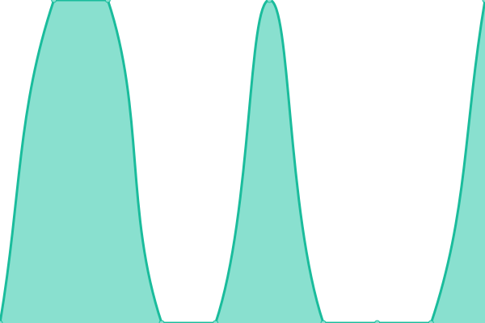
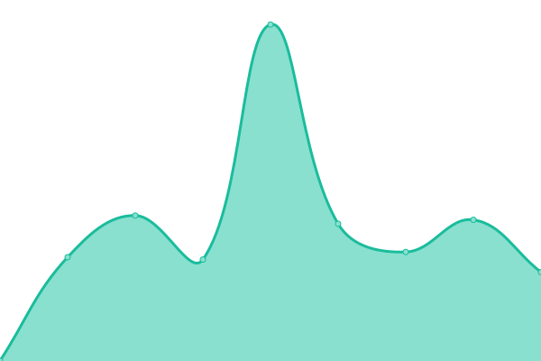
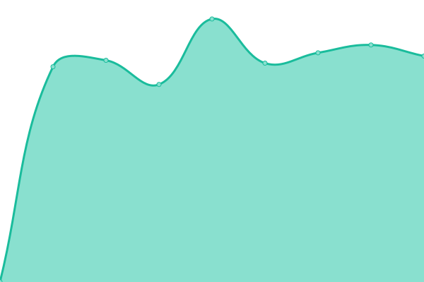

# [📈 Live Status](https://buluma.github.io/uptime): <!--live status--> **🟧 Partial outage**

This repository contains the open-source uptime monitor and status page for [Michael Buluma](https://www.buluma.me.ke/), powered by [Upptime](https://github.com/upptime/upptime).

With [Upptime](https://upptime.js.org), you can get your own unlimited and free uptime monitor and status page, powered entirely by a GitHub repository. We use [Issues](https://github.com/buluma/uptime/issues) as incident reports, [Actions](https://github.com/buluma/uptime/actions) as uptime monitors, and [Pages](https://buluma.github.io/uptime) for the status page.

<!--start: status pages-->
<!-- This summary is generated by Upptime (https://github.com/upptime/upptime) -->
<!-- Do not edit this manually, your changes will be overwritten -->
<!-- prettier-ignore -->
| URL | Status | History | Response Time | Uptime |
| --- | ------ | ------- | ------------- | ------ |
|  Google | 🟩 Up | [google.yml](https://github.com/buluma/uptime/commits/HEAD/history/google.yml) | 

 1614ms
     
 | 

<a href="https://buluma.github.io/uptime/history/google">100.00%</a>
    

|  Website | 🟥 Down | [website.yml](https://github.com/buluma/uptime/commits/HEAD/history/website.yml) | 

 439ms
     
 | 

<a href="https://buluma.github.io/uptime/history/website">0.00%</a>
    

|  Backup Server | 🟥 Down | [backup-server.yml](https://github.com/buluma/uptime/commits/HEAD/history/backup-server.yml) | 

 0ms
     
 | 

<a href="https://buluma.github.io/uptime/history/backup-server">0.00%</a>
    

|  VODA-DRC | 🟩 Up | [voda-drc.yml](https://github.com/buluma/uptime/commits/HEAD/history/voda-drc.yml) | 

 1370ms
     
 | 

<a href="https://buluma.github.io/uptime/history/voda-drc">100.00%</a>
    

|  VODA-SA | 🟩 Up | [voda-sa.yml](https://github.com/buluma/uptime/commits/HEAD/history/voda-sa.yml) | 

 2036ms
     
 | 

<a href="https://buluma.github.io/uptime/history/voda-sa">100.00%</a>
    

|  SEACOM | 🟩 Up | [seacom.yml](https://github.com/buluma/uptime/commits/HEAD/history/seacom.yml) | 

 886ms
     
 | 

<a href="https://buluma.github.io/uptime/history/seacom">100.00%</a>
    

|  TowerCO | 🟥 Down | [tower-co.yml](https://github.com/buluma/uptime/commits/HEAD/history/tower-co.yml) | 

 0ms
     
 | 

<a href="https://buluma.github.io/uptime/history/tower-co">0.00%</a>
    

<!--end: status pages-->

[**Visit our status website →**](https://buluma.github.io/uptime)

## 📄 License

- Powered by: [Upptime](https://github.com/upptime/upptime)
- Code: [MIT](./LICENSE) © [Michael Buluma](https://www.buluma.me.ke/)
- Data in the `./history` directory: [Open Database License](https://opendatacommons.org/licenses/odbl/1-0/)
