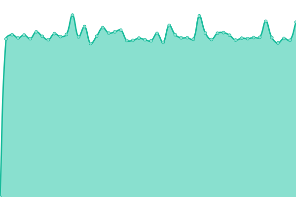

# [📈 Live Status](https://buluma.github.io/uptime): <!--live status--> **🟧 Partial outage**

This repository contains the open-source uptime monitor and status page for [Michael Buluma](https://www.buluma.me.ke/), powered by [Upptime](https://github.com/upptime/upptime).

With [Upptime](https://upptime.js.org), you can get your own unlimited and free uptime monitor and status page, powered entirely by a GitHub repository. We use [Issues](https://github.com/buluma/uptime/issues) as incident reports, [Actions](https://github.com/buluma/uptime/actions) as uptime monitors, and [Pages](https://buluma.github.io/uptime) for the status page.

<!--start: status pages-->
<!-- This summary is generated by Upptime (https://github.com/upptime/upptime) -->
<!-- Do not edit this manually, your changes will be overwritten -->
<!-- prettier-ignore -->
| URL | Status | History | Response Time | Uptime |
| --- | ------ | ------- | ------------- | ------ |
|  [Backup Server](http://docker.buluma.co.ke) | 🟩 Up | [backup-server.yml](https://github.com/buluma/uptime/commits/HEAD/history/backup-server.yml) | 

 472ms
     
 | 

<a href="https://buluma.github.io/uptime/history/backup-server">100.00%</a>
    

|  [Website](https://buluma.co.ke) | 🟩 Up | [website.yml](https://github.com/buluma/uptime/commits/HEAD/history/website.yml) | 

 9918ms
     
 | 

<a href="https://buluma.github.io/uptime/history/website">100.00%</a>
    

|  [Website2](https://buluma.me.ke) | 🟥 Down | [website2.yml](https://github.com/buluma/uptime/commits/HEAD/history/website2.yml) | 

 0ms
     
 | 

<a href="https://buluma.github.io/uptime/history/website2">5.11%</a>
    

|  Voda-DRC | 🟩 Up | [voda-drc.yml](https://github.com/buluma/uptime/commits/HEAD/history/voda-drc.yml) | 

 1653ms
     
 | 

<a href="https://buluma.github.io/uptime/history/voda-drc">100.00%</a>
    

|  Voda-SA | 🟩 Up | [voda-sa.yml](https://github.com/buluma/uptime/commits/HEAD/history/voda-sa.yml) | 

 1754ms
     
 | 

<a href="https://buluma.github.io/uptime/history/voda-sa">100.00%</a>
    

|  Seacom-KEUGSA | 🟩 Up | [seacom-keugsa.yml](https://github.com/buluma/uptime/commits/HEAD/history/seacom-keugsa.yml) | 

 29019ms
     
 | 

<a href="https://buluma.github.io/uptime/history/seacom-keugsa">100.00%</a>
    

<!--end: status pages-->

[**Visit our status website →**](https://buluma.github.io/uptime)

## 📄 License

- Powered by: [Upptime](https://github.com/upptime/upptime)
- Code: [MIT](./LICENSE) © [Michael Buluma](https://www.buluma.me.ke/)
- Data in the `./history` directory: [Open Database License](https://opendatacommons.org/licenses/odbl/1-0/)
